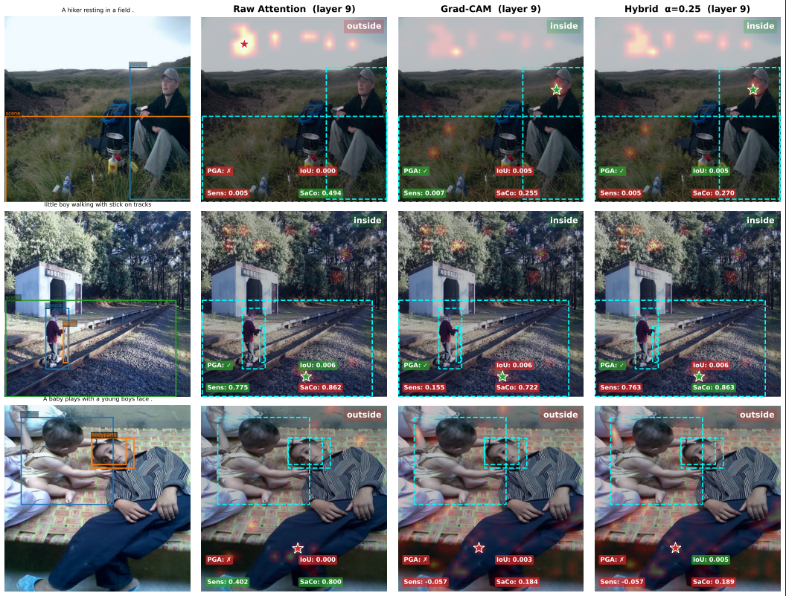

# VLM-Audit

A diagnostic toolkit for auditing cross-attention faithfulness in Vision-Language Models (VLMs). Rather than relying on qualitative heatmap visualisations, VLM-Audit quantitatively measures how well a model's internal attention maps reflect its actual decision-making process.

## Motivation

Modern VLMs (e.g. BLIP) use cross-attention to align image regions with text tokens, but raw attention weights are often uninterpretable or misleading. This toolkit evaluates **grounding accuracy** (do the highlighted regions match ground-truth object locations?) and **faithfulness** (does removing those regions actually hurt the model's confidence?) across selected transformer layers.

## Pipeline

```
Input (Image + Caption)
        │
        ▼
┌───────────────┐
│  Core Module  │  Loads the VLM, registers hooks on cross-attention layers
└───────┬───────┘
        │  attention cache  Dict[layer → Tensor]
        ▼
┌──────────────────────────────────────────────┐
│              Extraction Layer                │
│                                              │
│  AttentionExtractor  →  attention heatmaps   │
│  GradCAMExtractor    →  grad-cam heatmaps    │
│  HybridExtractor     →  alpha·attn +         │
│                         (1−alpha)·gradcam    │
└────────┬─────────────────────────────────────┘
         │  heatmaps  Dict[layer → Tensor (B, H, W)]
         ▼
┌──────────────────┐
│ Evaluation Suite │  Scores heatmaps against Flickr30k bounding-box annotations
└────────┬─────────┘
         │
         ▼
Output: reliability scorecard (IoU, Pointing Game, Sensitivity-n, SaCo)
        — evaluated separately for Attention, Grad-CAM, and each Hybrid alpha
```

## Repository Structure

```
vlm-audit/
├── core/                   # VLM wrapper and shared configuration
│   ├── config.py           #   AuditConfig — all hyperparameters in one place
│   └── model.py            #   VLMAuditModel — loads BLIP, registers attention hooks
│
├── data/                   # Dataset loading
│   └── flickr30k.py        #   Flickr30k Entities via HuggingFace datasets
│
├── extraction/             # Heatmap extraction from attention internals
│   ├── attention.py        #   Raw attention weights → upsampled spatial heatmaps
│   ├── gradcam.py          #   Grad-CAM over cross-attention layers
│   └── hybrid.py           #   Blended heatmap: alpha·attention + (1−alpha)·Grad-CAM
│
├── evaluation/             # Quantitative scoring
│   ├── grounding.py        #   Pointing Game Accuracy + IoU vs GT bounding boxes
│   ├── faithfulness.py     #   Sensitivity-n and SaCo via iterative pixel masking
│   └── results.py          #   EvalResults dataclass
│
├── scripts/
│   ├── config.sh           # Centralised path configuration
│   ├── conda_setup.sh      # Environment creation and package installation
│   └── run_audit.sh        # SLURM job script for the audit pipeline
│
├── run_audit.py            # Main entry point — wires all modules together
├── requirements.txt
└── pyproject.toml
```

## Dataset

[Flickr30k Entities](https://github.com/BryanPlummer/flickr30k_entities) — 31k images, each with 5 reference captions and bounding-box annotations per noun phrase.

| Source | What it provides |
|---|---|
| HuggingFace `nlphuji/flickr30k` | Images (PIL) |
| Local `data/Sentences/` | Captions with entity class tags |
| Local `data/Annotations/` | Bounding boxes per entity (XML) |

## Evaluation Metrics

**Grounding**
- *Pointing Game Accuracy* — is the peak heatmap pixel inside a ground-truth bounding box?
- *Mean IoU* — overlap between the thresholded heatmap and the union of GT boxes

**Faithfulness**
- *Sensitivity-n* — average confidence drop when the top-n% most salient pixels are masked
- *SaCo AUC* — area under the confidence-decay curve as pixels are masked from most to least salient

Both metrics are computed per layer, allowing identification of which transformer layers produce the most grounded and faithful explanations.

## Setup

Choose the option that matches where you are running the code.

---

### Option 1 — Local machine (outside cluster)

Use a Python virtual environment when running on your own laptop or desktop.

**Step 1 — update `scripts/config.sh`** so `SCRATCH_DIR` points to your repo root. `DATA_DIR` is derived as `$SCRATCH_DIR/data`, which is where your `Annotations/` and `Sentences/` folders should live:

```bash
PROJECT_DIR="/path/to/vlm-audit"   # absolute path to your cloned repo
SCRATCH_DIR="$PROJECT_DIR"         # DATA_DIR will resolve to $PROJECT_DIR/data
```

The scripts read `config.sh` automatically — no need to source it manually.

**Step 2 — create and activate the virtual environment:**

```bash
# Create (run once)
python3 -m venv .venv
```

Activate — pick the command for your terminal:

```bash
# macOS / Linux (bash, zsh)
source .venv/bin/activate

# PowerShell
.venv\Scripts\Activate.ps1

# Command Prompt
.venv\Scripts\activate.bat
```

You should see `(.venv)` in your prompt. Then install dependencies:

```bash
pip install "torch>=2.6" torchvision --index-url https://download.pytorch.org/whl/cu124
pip install -r requirements.txt
```

---

### Option 2 — NOTS cluster

#### First-time environment creation

**Step 1 — update `scripts/config.sh`** with your own paths:

```bash
PROJECT_DIR="$HOME/vlm-audit"        # path to your cloned repo
SCRATCH_DIR="/scratch/comp-646-g9"   # scratch space for the env and data
```

The scripts read `config.sh` automatically — no need to source it manually.

**Step 2 — submit the creation job:**

```bash
sbatch scripts/conda_setup.sh --create
```

This creates the Conda environment at `$SCRATCH_DIR/vlm_audit_env`, installs PyTorch (CUDA 12.4), and then installs everything in `requirements.txt`. Monitor progress with:

```bash
tail -f logs/setup_<JOBID>.log
```

#### Daily use

Once the environment exists, activate it with:

```bash
module load Miniforge3/25.3.0-3
conda activate /scratch/comp-646-g9/vlm_audit_env
```

#### Adding a new package

1. Add the package name to `requirements.txt` without a version number, e.g. `opencv-python`
2. Run the update job:
```bash
sbatch scripts/conda_setup.sh --update
```
3. Once installed, pin the exact version by running `pip show <package>` and updating the entry in `requirements.txt`, e.g.:
```bash
pip show opencv-python   # copy the Version field
# then update requirements.txt: opencv-python>=4.9.0
```

## Data

The pipeline uses [Flickr30k Entities](https://github.com/BryanPlummer/flickr30k_entities) for bounding-box annotations and captions, and HuggingFace for images.

### Option 1 — Local machine

1. Download the annotations archive from the [flickr30k_entities releases](https://github.com/BryanPlummer/flickr30k_entities/tree/master) page
2. Extract the zip
3. Copy the `Annotations` and `Sentences` folders into `data/`:

```
vlm-audit/
└── data/
    ├── Annotations/       ← XML bounding-box files (one per image)
    ├── Sentences/         ← Caption files with entity tags (one per image)
    └── test.txt           ← List of test-split image IDs
```

> `Annotations/` and `Sentences/` are git-ignored and must be set up locally by each team member.

### Option 2 — NOTS cluster

Download the annotations archive to the shared scratch location so all team members can access them:

1. Download the annotations archive from the [flickr30k_entities releases](https://github.com/BryanPlummer/flickr30k_entities/tree/master) page
2. Extract the zip
3. Copy the `Annotations` and `Sentences` folders into `$SCRATCH_DIR/data/` (wherever `SCRATCH_DIR` is set in `scripts/config.sh`):

```
$SCRATCH_DIR/data/
    ├── Annotations/       ← XML bounding-box files (one per image)
    └── Sentences/         ← Caption files with entity tags (one per image)
```

This only needs to be done once — the scratch location is shared across the team.

### Testing the data loader

With your environment active, run the test:

```bash
python -m data.test_flickr
```

This loads 3 images from the test split, checks captions and bounding boxes, and opens a matplotlib window showing each image with ground-truth boxes labelled by object class (e.g. `people`, `clothing`, `vehicles`).

## Usage

### Option 1 — Local machine

With your venv active, run the pipeline on a single layer to verify everything works:

```bash
python run_audit.py --layers 6 --max-samples 50 --output-dir results/test_run
```

### Option 2 — NOTS cluster (SLURM batch job)

Submit the audit as a SLURM job (runs unattended on a compute node):

```bash
sbatch scripts/run_audit.sh
```

The default job runs a single layer (`--layers 6`). Logs are written to `logs/audit<JOBID>.log` and `logs/audit<JOBID>.err`.

### Option 2 — NOTS cluster (interactive shell)

Request a GPU-enabled compute node and run the pipeline directly:

```bash
srun --pty --time=2:59:59 --gpus=1 --reservation=classroom --mem=64G $SHELL
```

Then activate the environment and run a single layer:

```bash
module load Miniforge3/25.3.0-3
conda activate /scratch/comp-646-g9/vlm_audit_env

python run_audit.py --layers 6 --max-samples 50 --output-dir results/test_run
```

---

### Full audit (all layers)

> **Warning:** Running all 12 layers with a large sample count takes a significant amount of time (90+ minutes depending on hardware). Make sure you have a GPU available and enough time allocated before starting.

**Specific layers:**

```bash
python run_audit.py \
  --model Salesforce/blip-itm-base-coco \
  --layers 6 7 8 \
  --max-samples 500 \
  --output-dir results/run_01
```

**All 12 layers with hybrid alpha sweep:**

```bash
python run_audit.py \
  --layers 0 1 2 3 4 5 6 7 8 9 10 11 \
  --hybrid-alphas 0.25 0.5 0.75 \
  --max-samples 500 \
  --output-dir results/hybrid_all12
```

## Visualization

### Pipeline figure (Figure 1)

Generates a 3-row × 4-column figure showing real examples side-by-side: original image with ground-truth boxes, raw attention heatmap, Grad-CAM heatmap, and hybrid blend (α=0.25). Each heatmap panel is annotated with per-sample PGA, IoU, Sensitivity, and SaCo scores.

Run from the repo root with your environment active:

```bash
python -m visualization.visualise_pipeline
```

Output is saved to `results/pipeline/fig1_pipeline.pdf`.

**Configuration** (edit constants at the top of [visualization/visualise_pipeline.py](visualization/visualise_pipeline.py)):

| Constant | Default | Description |
|---|---|---|
| `LAYER` | `9` | Transformer layer to visualise (set in `visualise_maps.py`) |
| `ALPHA` | `0.25` | Hybrid blend weight (attention fraction) |
| `N_SEARCH` | `150` | Number of samples to scan when selecting examples |
| `START_IDX` | `50` | Dataset index to start scanning from |
| `SACO_STEPS` | `10` | Masking steps for SaCo — increase to `20` for final figures |

The script runs on CPU and selects 3 diverse examples automatically: one where Grad-CAM outperforms attention, one where both methods are correct, and a fallback.


